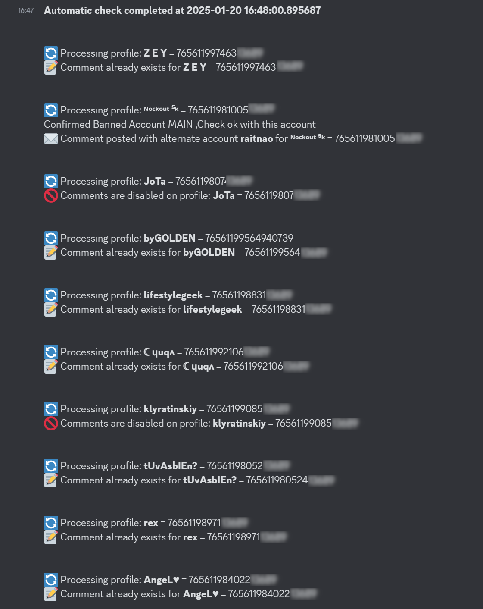

Here's the English translation of your README:

---

# HarcelBot

A bot designed to post comments in a loop on Steam profiles.

## Explanation

The idea came to me when I discovered that a cheater in **CS2** had deleted the comments on his Steam profile to avoid being suspected during his next games. For two weeks, I posted comments daily, and he kept deleting them. Yes, I'm a big rage-a-holic.

To combine the useful with the enjoyable, I developed a Discord bot that automates this process: it can post comments and manage Steam profiles directly from Discord.

### How does it work?

The bot, developed in Python, uses Selenium to automate the login and management of Steam profiles. By importing cookies, the bot logs into Steam automatically.

Here are its main features:

- **Comment verification**: If a comment is already present, it will not repost it.
- **Multi-account system**: In case of ban or shadowban, it automatically switches to another account.
- **Automatic detection**: Handles all possible cases, such as bans or expired cookies.
- **Updates via Discord**: You can manage cookies and profiles directly from a Discord server.
- **Feedback on Discord**: Results of actions are sent to a defined channel.

If the target disables comments, you can consider the battle won!

### Features

- Automatic addition of pre-defined comments.
- Management of multiple Steam accounts.
- Continuous loop to check and post comments.
- Detection of bans, shadowbans, and comment deletions.
- Updates and control via Discord commands.
- Return of results directly to Discord.

---

## Installation

### Prerequisites

- An operational Discord bot (with the necessary permissions and token configured).
- Python installed on your system.

### Installing dependencies

Run the following command to install the dependencies:

```bash
pip install -r requirements.txt
```

### Cookie Configuration

**Main cookies**:

- `cookie.json`: Used for the main account that posts the comments.
- `cookie_temoin.json`: Used only to check if the main account is banned or shadowbanned.

**Backup cookies**:

Place the cookies from alternative accounts in the `./cookies` folder.

To export Steam cookies, use the [Cookie-Editor](https://cookie-editor.com/) extension and save them in JSON format. **Do not modify the content of the cookies**.

### Configuring Steam profiles

The `profiles.json` file contains the profiles to comment on. Here's an example:

```json
{
    "76561198402210832": {
        "name": "Profile Name",
        "comment": "This player cheats, do not trust.",
        "keyword": "This player cheats",
        "ban": 0
    }
}
```

### Script Configuration

Modify the following variables in the script:

```python
# Configuration
COOKIES_DIR = r'.\cookies'

COOKIE_PATH = r'.\BotSteamComment\cookie.json'
TEMOIN = r'.\cookie_temoin.json'
PROFILES_PATH = r'.\profiles.json'
CHANNEL_ID = XXXXX  # Replace XXXXX with the Discord channel ID.
BOT_TOKEN = "YOUR TOKEN"  # Replace with your Discord bot token.
```

---

## Usage

Launch the `bot.py` file:

```bash
python3 bot.py
```

### Debug Mode

To display the bot's actions in a visible browser, comment out this line:

```python
chrome_options.add_argument("--headless")
```

### Functioning

Here’s a simplified flowchart of how the bot works:



---

## Discord Commands

| **Command**        | **Example**                      | **Description**                                                                                     |
|---------------------|----------------------------------|-----------------------------------------------------------------------------------------------------|
| **!update_cookies**  | `!update_cookies` *(with attached file)* | Updates the bot's cookies to log into Steam. Attach a `cookie.json` file to your message. |
| **!update_profiles** | `!update_profiles` *(with attached file)* | Updates the list of Steam profiles to monitor. Attach a `profiles.json` file to your message. |
| **!force_check**     | `!force_check`                  | Immediately triggers a check for comments on the configured profiles. Results will be shown in the channel. |
| **!show_profiles**   | `!show_profiles`                | Displays the current list of Steam profiles in JSON format. |

---

## Disclaimer

I am in no way responsible for the actions you might take with this bot. This code is provided for educational purposes only. If your Steam account or trading ability is banned, **you fully assume the risks**.

---

Feel free to tweak any section further or let me know if you need any additional changes!