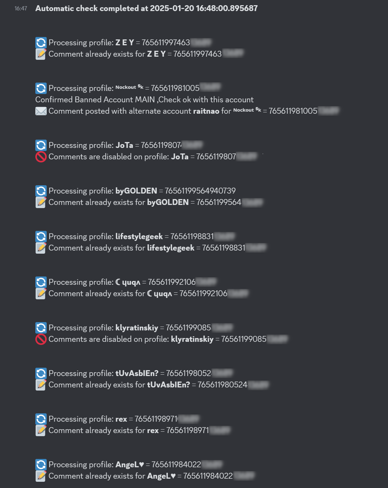

# HarcelBot

[EN-Version](README-EN.md)

Un bot conçu pour poster des commentaires en boucle sur les profils Steam.

## Explication

L'idée m'est venue en découvrant qu'un cheater sur **CS2** avait supprimé les commentaires de son profil Steam pour éviter d'être suspecté lors de ses prochaines parties. Pendant deux semaines, j'ai posté des commentaires quotidiennement, et lui les supprimait. **Oui, je suis un méga rageux.**

Pour allier l'utile à l'agréable, j'ai développé un bot Discord permettant d'automatiser ce processus : il peut poster des commentaires et gérer les profils Steam directement depuis Discord.

### Comment ça marche ?

Le bot, développé en Python, utilise [Selenium](https://www.selenium.dev/) pour automatiser la connexion et la gestion des profils Steam. Grâce à l'importation de cookies, le bot se connecte automatiquement à Steam.

Voici ses fonctionnalités principales :
- **Vérification des commentaires** : si un commentaire est déjà présent, il ne le reposte pas.
- **Système multi-comptes** : en cas de ban ou shadowban, il bascule automatiquement sur un autre compte.
- **Détection automatique** : gère tous les cas possibles, comme les bans ou cookies expirés.
- **Mises à jour via Discord** : vous pouvez gérer les cookies et les profils directement depuis un serveur Discord.
- **Retours sur Discord** : les résultats des actions sont envoyés dans un canal défini.

Si la cible désactive les commentaires, c'est vraiment une méga miskine, et vous pouvez considerez que vous avez largement gagné. Ils ont plié ces grosses victimes.

---

### Features

- Ajout automatique de commentaires préalablement définis.
- Gestion de multiples comptes Steam.
- Boucle continue pour vérifier et poster des commentaires.
- Détection des bans, shadowbans, et suppression de commentaires.
- Mise à jour et contrôle via des commandes Discord.
- Retour des résultats directement sur Discord.

---

## Installation

### Prérequis

- Un bot Discord opérationnel (avec les permissions nécessaires et le token configuré).
- Python installé sur votre système.

### Installation des dépendances

Utilisez la commande suivante pour installer les dépendances :

```bash
pip install -r requirements.txt
```

### Configuration des cookies

1. **Cookies principaux :**
   - `cookie.json` : utilisé pour le compte principal qui poste les commentaires.
   - `cookie_temoin.json` : utilisé uniquement pour vérifier si le compte principal est banni ou shadowbanni.
2. **Cookies de secours :**
   - Placez les cookies des comptes alternatifs dans le dossier `./cookies`.

Pour exporter les cookies Steam, utilisez l'extension [Cookie-Editor](https://cookie-editor.com/) et sauvegardez-les au format JSON. **Ne modifiez pas le contenu des cookies.**

### Configuration des profils Steam

Le fichier `profiles.json` contient les profils à commenter. Voici un exemple :

```json
{
    "76561198402210832": {
        "name": "Nom du profil",
        "comment": "Ce joueur triche, ne faites pas confiance.",
        "keyword": "Ce joueur triche",
        "ban": 0
    }
}
```

### Configuration dans le script

Modifiez les variables suivantes dans le script :

```python
# Configuration
COOKIES_DIR = r'.\cookies'

COOKIE_PATH = r'.\BotSteamComment\cookie.json'
TEMOIN = r'.\cookie_temoin.json'
PROFILES_PATH = r'.\profiles.json'
CHANNEL_ID = XXXXX  # Remplacez XXXXX par l'ID du canal Discord.
BOT_TOKEN = "UR TOKEN"  # Remplacez par le token de votre bot Discord.
```

---

## Utilisation

Lancez simplement le fichier `bot.py` :

```bash
python3 bot.py
```

### Mode Debug

Pour afficher les actions du bot dans un navigateur visible, commentez cette ligne :

```python
chrome_options.add_argument("--headless")
```

---

## Fonctionnement

Voici un schéma simplifié du fonctionnement du bot :



---

## Commandes Discord

| **Commande**        | **Exemple**                      | **Description**                                                                                     |
|----------------------|----------------------------------|-----------------------------------------------------------------------------------------------------|
| **!update_cookies**  | `!update_cookies` *(avec fichier attaché)* | Met à jour les cookies du bot pour se connecter à Steam. Attachez un fichier `cookie.json` à votre message. |
| **!update_profiles** | `!update_profiles` *(avec fichier attaché)* | Met à jour la liste des profils Steam à surveiller. Attachez un fichier `profiles.json` à votre message. |
| **!force_check**     | `!force_check`                  | Lance immédiatement une vérification des commentaires sur les profils configurés. Résultats affichés dans le canal. |
| **!show_profiles**   | `!show_profiles`                | Affiche la liste actuelle des profils Steam configurés dans un format JSON.                          |

---

## Disclaimer

Je ne suis en aucun cas responsable des actions que vous pourriez entreprendre avec ce bot. Ce code est fourni à titre éducatif. Si votre compte Steam ou votre capacité de trading est banni, **vous en assumez pleinement les risques.**

---

